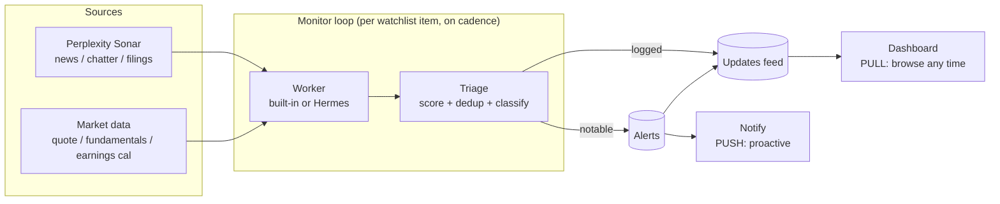
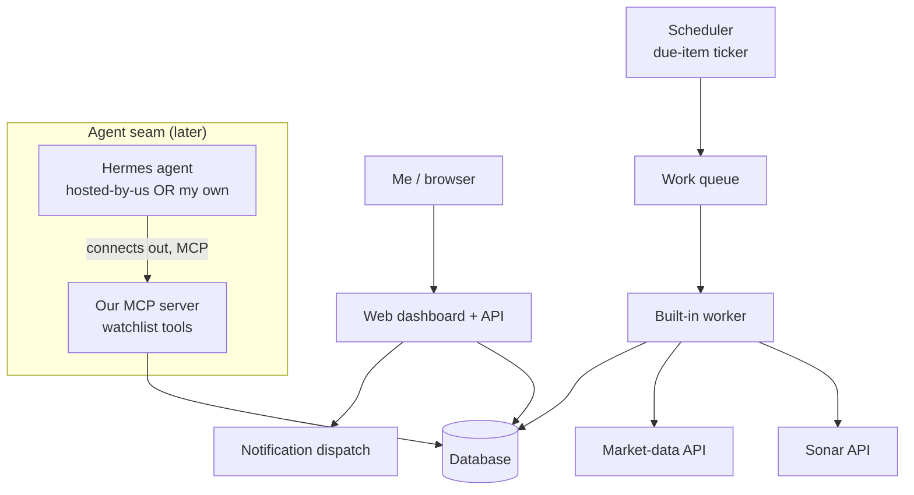

# Blue Horseshoe — Technical Blueprint

> Working codename: **Blue Horseshoe** (from the repo name; rename later).
> Status: **living design doc.** Tech stack is deliberately deferred — see [§13](#13-open-decisions--whats-next). This document is the "what and why"; the stack discussion is the "with what."

Companion to [`vision.md`](./vision.md). Where the vision is the one-paragraph pitch, this is the full technical picture agreed so far.

---

## 1. What we're building (in one breath)

A **personal, always-on stock-monitoring platform**. You add the tickers you hold or are watching; each gets a clean **profile page**; and a background **monitor** perpetually watches every name for material developments — news, filings, social chatter, price action. The platform runs in **two modes on the same data**:

- **Pull — the dashboard.** Log in any time and see, per stock, "what's new since I last looked": a triaged feed of developments with sources.
- **Push — the agent.** Between your logins, the monitor is triaging. When something lands that could move the price **materially and soon** (earnings surprise, guidance cut, M&A, a regulatory hit, a viral thread), it notifies you proactively. Everything else accumulates quietly in the feed.

Mental model: **Perplexity Finance's data + a "notable events" UI + a proactive alerting layer.** The monitor's real job isn't fetching — it's **triage**: separating *"tell him now"* from *"log it, he'll see it later."* That judgment is the product.

### Confirmed decisions (this conversation)

| Decision | Choice |
|---|---|
| Audience / deployment | **Single user (me), but hosted** — deployed to the cloud so alerts fire 24/7 and I can log in from anywhere. Model multi-user cleanly, but don't build for it yet. |
| Qualitative data engine | **Perplexity Sonar API** — real-time web/news, cited sources as metadata, structured JSON output. |
| Quantitative data | A dedicated **market-data provider** (TBD — Finnhub / FMP / Polygon / Alpha Vantage class). |
| Monitoring executor | **Pluggable worker behind one interface.** v1 ships a **built-in worker**; a **Hermes agent** (Nous Research) can be linked later via the same contract. |
| Alert *delivery* | **Deferred.** Model alerts as first-class records now (a notification with a channel + status); wire an actual channel later. |
| Runtime | **TypeScript, end-to-end** — one language for dashboard, API, workers, and MCP server. |
| Hosting | **Vercel** (serverless). See the serverless reframing in [§4](#4-system-architecture) / [§12](#12-non-functional-requirements). |
| Framework / DB / ORM | **Next.js** (App Router) · **Neon Postgres** (via Vercel Marketplace) · **Drizzle ORM** · **Tailwind + shadcn/ui**. |
| Durable jobs layer | **Deferred to Phase 2** (Inngest / Vercel Workflows / QStash — pick when we build the monitor). |
| Market-data provider | **TBD** — Phase 1 runs behind a provider abstraction with a mock adapter, so it works with **no API key**. |

### Build phasing (this conversation)

- **Phase 1 — the dashboard (pull side, real & polished).** Watchlist: find/add/remove equities. A **Perplexity-Finance-style Stock page** (quote, key stats, about, chart, news). The monitoring/updates panel is a **placeholder** for now. This is the focus.
- **Phase 2 — the monitor (push side).** Scheduler + jobs layer + built-in worker + Sonar + triage + Alerts, then the Hermes/MCP agent seam. Fills in the placeholders.

---

## 2. Core concepts (domain language)

Use these words consistently across code, UI, and docs.

- **Security** — a public equity (ticker + exchange + identifiers). The canonical thing being monitored.
- **Watchlist item** — my inclusion of a Security, with optional holding info, notes, and a per-item cadence/sensitivity override.
- **Profile** — the overview page for a Security: quote, fundamentals, and its Update feed. Perplexity-Finance-style.
- **Update** — a single monitored finding about a Security: a categorized, summarized development with cited sources, a detection time, and a **materiality score**. Every finding is an Update; most stay *logged*.
- **Alert** — an Update the triage layer judged **notable** and promoted for proactive notification. An Alert has a delivery channel and status.
- **Monitor run** — one execution of the loop for one watchlist item: what window it covered, which worker ran it, what it cost, and the cursor it advanced.
- **Cadence** — how often a watchlist item is swept (6 / 12 / 24 / 48h; global default with per-item override).
- **Worker / Agent binding** — the executor that fulfills a Monitor run. Either the **built-in worker** or a linked **Hermes agent**. Selected per-item or globally.
- **Notification channel** — where an Alert is delivered (in-app, email, messaging…). Abstracted; only in-app is required for v1.

---

## 3. The two modes, precisely



- **Pull** reads the Updates feed and Profile data. Always available, no urgency.
- **Push** fires only on Updates promoted to Alerts. Rare by design — false positives are the failure mode that erodes trust fastest.
- An Alert is *also* an Update (it shows in the feed **and** notifies), so the feed is the complete record and notifications are a subset.

---

## 4. System architecture



**Components**

1. **Web dashboard + API** — the pull surface (watchlist CRUD, profile pages, feed, settings/integrations) and the control plane.
2. **Database** — securities, watchlist, updates, alerts, runs, bindings, settings. Source of truth.
3. **Scheduler** — wakes on a tick, finds watchlist items whose `next_due <= now`, enqueues Monitor runs. This is what makes it "always-on."
4. **Work queue + workers** — decouples "it's due" from "it's running." Enables retries, backoff, rate-limit smoothing, and concurrency control against provider limits.
5. **Built-in worker** — v1 executor: calls Sonar (+ market data), returns structured candidates, hands to triage.
6. **Triage** — scores, dedups, classifies logged vs notable, writes Updates/Alerts. (See [§6](#6-triage--the-materiality-model).)
7. **Agent seam (MCP server)** — the later executor path; a Hermes agent connects *out* to it. (See [§7](#7-the-agent-layer-pluggable-workers).)
8. **Notification dispatch** — turns Alerts into deliveries per channel + settings. v1: in-app only.

**Why a queue and not "cron calls Sonar inline"?** Provider rate limits, cost spikes, ret/backoff on flaky sources, and — crucially — the same enqueue path serves both the built-in worker and a Hermes agent. The queue *is* the pluggability boundary.

**Serverless reframing (Vercel).** Vercel has no always-on process, so components 3–5 map to serverless primitives: the **Scheduler** is **Vercel Cron** hitting a tick endpoint; the **queue + workers** are a **durable jobs layer** (Inngest / Vercel Workflows / QStash — chosen in Phase 2) that runs our code on Vercel with retries, concurrency caps, and per-stock fan-out; **Fluid Compute** covers long Sonar calls (up to ~13 min on Pro). This is strictly *better* for a solo tool than a hand-rolled daemon — nothing to babysit — and it's all Phase 2. Phase 1 needs none of it.

---

## 5. The monitoring loop, step by step

For each due watchlist item:

1. **Select** — scheduler finds items where `next_due <= now`, respecting per-item cadence.
2. **Assemble task** — build a **MonitorTask**: the Security, the **window** since `last_seen_cursor`, cadence, sensitivity, and `recent_update_keys` (for dedup context).
3. **Dispatch** — route to the item's bound worker (built-in or Hermes).
4. **Gather** — the worker:
   - asks **Sonar** for *material developments on $TICKER in [window]* → structured JSON (category, headline, summary, sources, timestamps);
   - pulls **market-data deltas** — price move %, volume spike vs average, proximity to a known earnings/dividend date.
5. **Return** — a **MonitorResult**: a list of candidate Updates + an advanced cursor + cost/token accounting.
6. **Triage** — score each candidate, dedup against `recent_update_keys` and stored Updates, classify **logged** vs **notable**.
7. **Persist** — write Updates; for notable ones create Alerts and enqueue notifications (subject to settings, quiet hours, rate caps).
8. **Record** — write the Monitor run (window, worker, cost, tokens, cursor) and set `next_due = now + cadence`.

**State that makes it stateful, not amnesiac:** the `last_seen_cursor` (time or content watermark) and `recent_update_keys` (dedup fingerprints) per item. Without them the monitor re-reports the same news every sweep — the fastest way to train me to ignore it.

---

## 6. Triage — the materiality model

The intellectual core. Goal: assign each candidate Update a **materiality score**, then classify.

**Inputs to the score**

| Signal | Intuition |
|---|---|
| **Event category weight** | M&A, earnings surprise, guidance change, regulatory/legal, exec departure, dividend/buyback, analyst rating change, product recall, macro-linked, social virality — each carries a different base impact. |
| **Signal strength / confirmation** | A confirmed 8-K filing ≫ a single unsourced rumor. Source authority and corroboration count matter. |
| **Market corroboration** | Is price/volume *already* moving? A move + a story is far more material than either alone. |
| **Novelty** | Is this new, or a rehash of something already in the feed? De-weight the already-seen. |
| **Proximity** | Distance to a scheduled catalyst (earnings in 2 days raises the bar's sensitivity). |

**Classification**

- `score < threshold` → **logged** (feed only).
- `score >= threshold` → **notable** → create Alert → notify.
- Threshold is **configurable**, with a **per-item sensitivity** knob (a name I hold heavily wants a lower bar than one I'm idly watching).

**Anti-noise rules (non-negotiable for trust)**

- **Dedup** on content fingerprint + a cooldown window, so the same story never alerts twice.
- **Rate cap / digest fallback** — beyond N alerts/hour for one name, batch into a digest instead of spamming.
- **Quiet hours** — urgent categories may override; the rest wait.

> v1 can start with a **transparent weighted rubric** (explainable, tunable by hand) and only later consider learned scoring. Explainability early is worth more than accuracy — I need to trust *why* it pinged me.

---

## 7. The agent layer (pluggable workers)

**Principle:** the platform never hard-codes *how* monitoring runs. It defines a contract; any backend that fulfills it is interchangeable.

### The contract

```
MonitorTask {
  security:       { ticker, exchange, identifiers }
  window:         { since, until }
  cadence:        duration
  sensitivity:    number
  priorState:     { last_seen_cursor, recent_update_keys[] }
}

MonitorResult {
  updates: [ { category, headline, summary, sources[], detected_at, signals{...}, dedup_key } ]
  cursor:  new watermark
  cost:    { tokens, requests, provider }
  notes?:  string
}
```

### Backend A — built-in worker (v1)

Runs in-process/queue. Calls Sonar + market-data directly, returns a `MonitorResult`. Ships first so the product works end-to-end on day one with zero external agent setup.

### Backend B — Hermes agent (v2 seam)

Grounded in how Hermes actually works (verified against Nous docs, 2026):

- Hermes has **no inbound REST API**. Its control surfaces are a **messaging gateway** (Telegram/Slack/Discord/Email/…), **built-in cron** ("cron with delivery to any platform"), **MCP**, and programmatic `execute_code`.
- **Nous Portal** auth is **OAuth** (browser login → refresh token at `~/.hermes/auth.json` → short-lived JWT per call), bundling 300+ models + a tool gateway (Firecrawl web, Browser Use, Modal sandboxes, FAL, TTS).

**Therefore the seam is inverted — the agent reaches out to us:**

- **Our platform exposes an MCP server** with watchlist tools:
  - `list_due_stocks()` → the MonitorTasks currently due
  - `get_stock_context(ticker)` → prior cursor, recent update keys, holding info
  - `submit_updates(ticker, updates[], cursor)` → hand back a MonitorResult
  - (optionally `get_sonar_digest(ticker, window)` if we want the agent to use *our* Sonar rather than its own tools)
- A Hermes agent connects **to** that MCP server, uses **its own cron** to poll `list_due_stocks`, does the monitoring with Portal's tools (or our Sonar tool), and pushes results back via `submit_updates`. Optionally we nudge it via a channel message when something is urgently due.

**This dissolves the "spawn vs link" fork you raised:**

| | Hosted-by-us | Bring-your-own |
|---|---|---|
| Where Hermes runs | our VPS/Modal, our Portal sub | your machine/VPS, your Portal sub |
| How it connects | to our MCP server, with a binding token | to our MCP server, with a binding token |
| Contract | identical | identical |

So "we host an agent for you" and "link your existing agent" differ only in **where it runs and which binding token it uses** — a settings/integrations page detail, not an architecture decision. Build the MCP seam once; support both.

### Selecting a backend

`Agent binding` per item (or global default): `builtin` | `hermes:<binding_id>`. The scheduler routes accordingly. Both write identical Updates, so the rest of the system is agnostic.

---

## 8. Data layer — who provides what

| Need | Provider | Notes |
|---|---|---|
| News, chatter, filings, "material developments" summaries, sentiment | **Perplexity Sonar** | `sonar-pro` for routine sweeps; `sonar-deep-research` for deeper, less-frequent passes. Structured JSON output; citations returned as metadata (URLs, titles, snippets, dates). Per-request fee + token cost — cadence and model tier are the cost levers. |
| Quote, fundamentals, historical prices, earnings/dividend calendar | **Market-data API (TBD)** | Sonar won't give clean structured numbers. Candidates: Finnhub, FMP, Polygon, Alpha Vantage (several have usable free tiers). Powers the profile numbers **and** the "market corroboration" triage signal. |

**Caching:** market data (quotes/fundamentals) is cached with short TTLs; profile pages read cache, not the provider, on every view. Sonar results are stored as Updates — never re-queried for the same window.

---

## 9. Data model (entities, stack-agnostic)

- **User** — single row for now, but modeled so multi-user is a migration, not a rewrite.
- **Security** — `ticker, exchange, name, type, identifiers (CIK/ISIN/…), sector`.
- **WatchlistItem** — `user, security, added_at, holding_qty?, holding_cost?, notes, cadence_override?, sensitivity_override?, agent_binding?, next_due, last_seen_cursor`.
- **Update** — `security, watchlist_item, category, headline, summary, sources[], detected_at, materiality_score, status (logged|notable), dedup_key, raw_signals`.
- **Alert** — `update, created_at, channel, delivery_status (pending|sent|failed|suppressed), read_at?`.
- **MonitorRun** — `watchlist_item, worker, window_start, window_end, started_at, finished_at, cost_tokens, cost_requests, candidates_count, updates_count, alerts_count, error?`.
- **AgentBinding** — `type (builtin|hermes), label, mcp_token?, enabled, created_at`.
- **NotificationSetting** — `channel, enabled, quiet_hours, threshold_override, digest_rules`.
- **ProfileSnapshot** (cache) — `security, quote, fundamentals, earnings_next, fetched_at`.

---

## 10. API & surfaces (sketch)

**Dashboard (pull):**
- Watchlist: list / add / remove / edit (cadence, sensitivity, notes, holding).
- Profile: `GET /securities/:ticker` → snapshot + paginated Update feed.
- Feed: `GET /feed` → cross-watchlist Updates, filterable (notable-only, by category, by name).
- Alerts: `GET /alerts`, mark-read.
- Manual trigger: `POST /watchlist/:id/refresh` → enqueue an immediate Monitor run (great for v0 and debugging).
- Settings/integrations: manage Agent bindings + notification channels.

**Agent seam (MCP):** `list_due_stocks`, `get_stock_context`, `submit_updates`, `get_sonar_digest?` — authenticated per AgentBinding token.

**Internal:** scheduler tick, worker queue, notification dispatch.

---

## 11. Notifications (modeled now, delivered later)

Per the decision to defer delivery:

- Alerts are **first-class records** with a `channel` and `delivery_status`. v1 sets `channel = in_app`; the badge/feed is the delivery.
- `NotificationChannel` is an **abstraction** — adding email or a Telegram/Slack push later is a new channel implementation + a settings toggle, not a schema change.
- Delivery honors: notification settings, quiet hours, per-name rate caps, and urgent-category overrides.
- Because Hermes *itself* can deliver to messaging platforms, one future option is: the platform raises the Alert; a linked Hermes agent (or our dispatch) delivers it. Both fit the channel abstraction.

---

## 12. Non-functional requirements

- **Always-on hosting** (the "hosted" decision) — on Vercel this is **serverless-always-on**: a persistent DB (**Neon**), **Vercel Cron** as scheduler, a **durable jobs layer** in place of a running worker, Next.js route handlers as the web/API tier, **Vercel env vars** as the secrets store (Sonar key, market-data key, Portal/MCP tokens), and an MCP route via **`@vercel/mcp-adapter`** for the agent seam.
- **Cost control** — cadence tuning, Sonar model tiering, aggressive market-data caching, and dedup (never pay to re-report). Track spend per Monitor run so cost is visible, not a surprise bill.
- **Rate limits & resilience** — queue-level concurrency caps, exponential backoff, partial-failure tolerance (market data down shouldn't block the Sonar sweep).
- **Security** — single-user auth on the dashboard; encrypted secrets; per-binding MCP tokens (revocable); no secrets in logs.
- **Observability** — every Monitor run is a record (window, cost, counts, errors); alert-quality is reviewable after the fact (did notable ones actually move the stock?).

---

## 13. Roadmap (phased)

**Phase 1 — the dashboard (✅ built).** The pull side, real and polished:
- Watchlist: **search/find equities and add/remove** them.
- **Stock page, Perplexity-Finance-style**: quote + change, key stats grid, about/description, price chart, recent news.
- **Cross-watchlist view** (the home dashboard).
- The **monitoring / updates panel is placeholder UI** — the shape is there, the engine isn't.
- Runs behind a **market-data provider abstraction with a mock adapter**, so it works with no API key while we pick a provider.

**Phase 2 — the monitor.** The push side, filling Phase 1's placeholders:
- Pick the **jobs layer** (Inngest / Vercel Workflows / QStash) and **market-data provider**.
- **Vercel Cron scheduler** + **built-in worker** + **Sonar** integration + **triage/materiality** model + in-app **Alerts feed**.
- Then the **agent seam**: `@vercel/mcp-adapter` MCP server + AgentBinding + integrations/settings page; link a Hermes agent (BYO), then a hosted-Hermes option — identical contract to the built-in worker.

**Phase 3+ — delivery & depth.** Real notification channels (email/Telegram), digests, portfolio-level rollups, and **alert-quality backtesting** (did "notable" predict a move?) to tune the materiality model.

---

## 14. Open decisions / what's next

Stack is decided (TS · Next.js · Vercel · Neon · Drizzle · Tailwind/shadcn). Remaining:

1. **Market-data provider** *(needed to un-stub Phase 1)* — pick from Finnhub / FMP / Polygon / Alpha Vantage on coverage vs free-tier vs cost. Phase 1 ships against a mock adapter until chosen.
2. **Jobs layer** *(Phase 2)* — Inngest / Vercel Workflows / QStash.
3. **Sonar tiering & budget** *(Phase 2)* — which model at which cadence; a monthly ceiling.
4. **Materiality rubric v1** *(Phase 2)* — the concrete category weights and threshold defaults.
5. **Name** — keep "Blue Horseshoe" or not.
